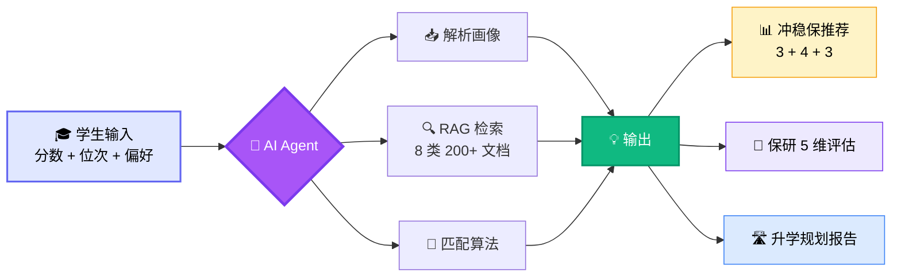
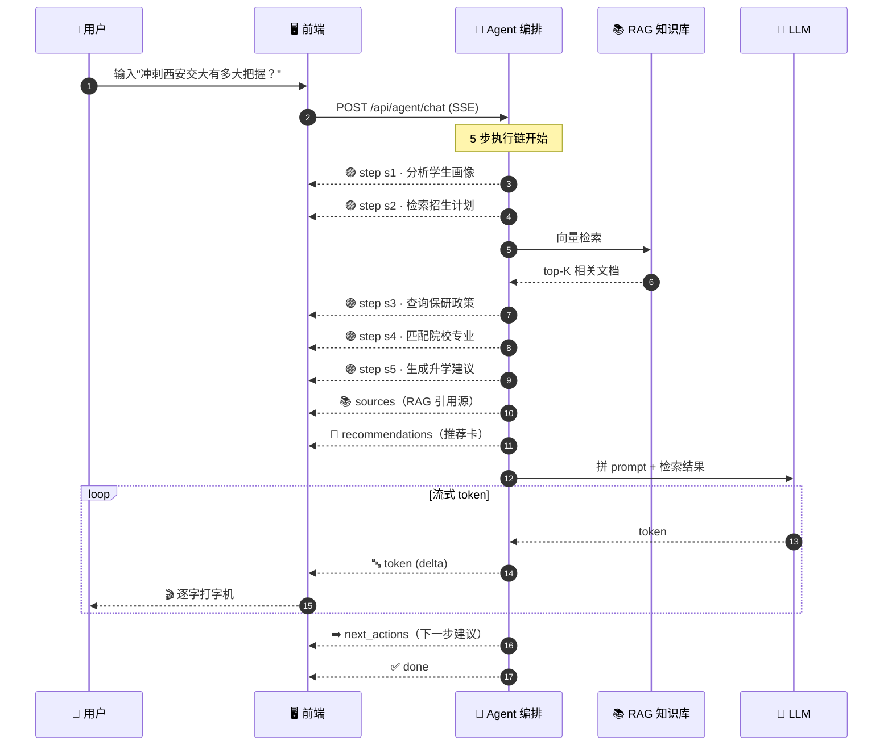
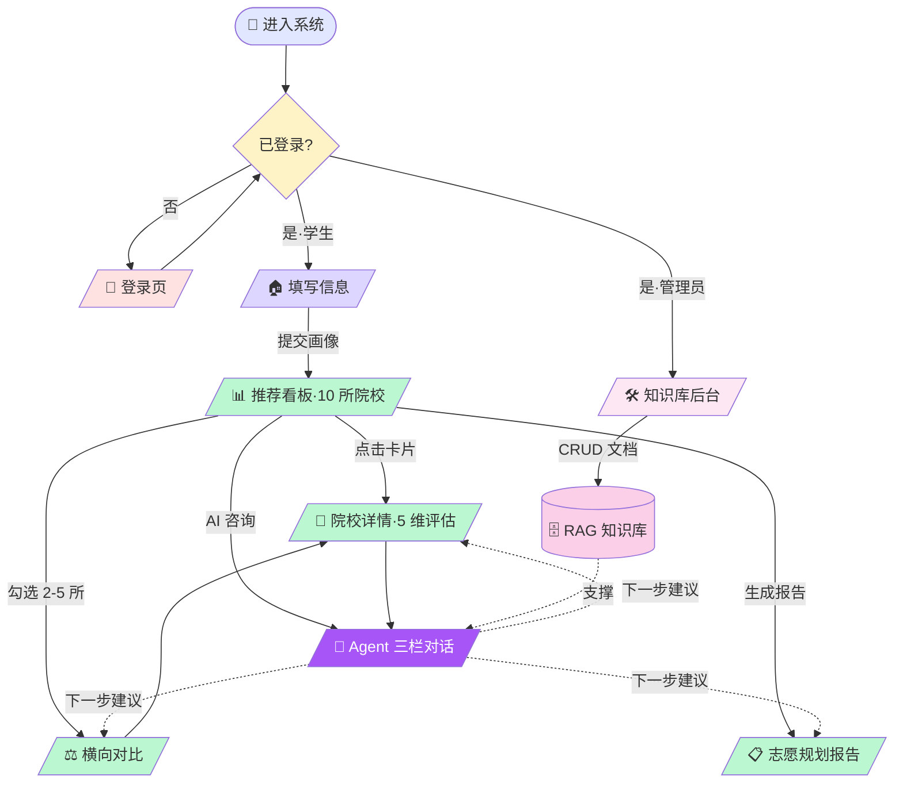

<div align="center">

# 🎓 高考志愿填报 AI Agent

### 为高考一本线上考生设计的 **AI Agent 驱动 + RAG 知识库** 智能志愿规划系统

<br/>

**让"我能考上哪？"变成"我应该选哪？"**

<br/>

[](https://react.dev/)
[](https://www.typescriptlang.org/)
[](https://vitejs.dev/)
[](https://tailwindcss.com/)
[](https://ui.shadcn.com/)
[](https://recharts.org/)

<br/>

**📋 [完整接口规范](./docs/接口规范.md)** · **📊 [数据采集要求](./docs/数据收集要求.md)**

</div>

---

## 🎯 一图看懂产品



> 不只是"分数能上哪所学校"——而是 **5 维度评估你 4 年后的保研竞争力 + AI Agent 像顾问一样陪你聊**。

---

## ✨ 8 大产品亮点

<table>
<tr>
<td width="50%" valign="top">

### 🤖 真正的 AI Agent 体验

**5 步可视化执行链**：分析画像 → 检索招生 → 查保研政策 → 匹配院校 → 生成建议，每步都看得见 AI 在干啥。

- ⚡ **快速模式**：5 步 / 3 source
- 🔬 **深度模式**：7 步 / 5 source / 扩展分析段
- 🧠 **上下文缓存**：第 2+ 轮提问，已分析画像自动 cached，节省 token
- 📡 **SSE 流式输出**：逐字打字机，节奏从容

</td>
<td width="50%" valign="top">

### 🎯 保研 5 维评估（行业首创）

**不再是"较高 / 较好"模糊评价**，每个维度都有：

- 📊 **0-10 分制评分**
- 📝 一句话评估理由
- 📈 **4 条原始数据**（如"学院保研率 28%"）
- 📚 **明确文件来源**（如"2024 推免实施细则"）

5 维：推免机会 / 竞争友好度 / 成绩可控性 / 科研加分空间 / 升学去向质量

</td>
</tr>
<tr>
<td width="50%" valign="top">

### 📚 RAG 知识库引用

**8 类知识源**全程可溯：

`招生数据` · `录取数据` · `保研政策` · `专业信息`<br/>
`培养方案` · `奖学金政策` · `转专业政策` · `院校官网`

每条 AI 回答下方展示**命中的原文摘录** + 关联说明，告别"AI 瞎编"。

</td>
<td width="50%" valign="top">

### 🧠 AI 记忆浮窗

Agent 自动累积对话上下文：

- 📌 **对话中你强调过的**（按提及次数排序）
- 🏫 **你提及过的院校**（含频次）
- 🔍 **最近关注的话题**
- 📊 会话轮数 / 时长

让 AI 真的"懂你"，不是每轮都从零开始。

</td>
</tr>
<tr>
<td width="50%" valign="top">

### 🔐 完整登录权限系统

| 角色 | 默认账号 | 可访问 |
|------|----------|--------|
| 👑 管理员 | `admin / admin123` | 全部 + 知识库后台 |
| 🎓 学生 | `student / 123456` | 全部用户功能 |
| 🚫 游客 | – | 仅登录页 |

路由级 `RequireAuth` 守卫 + JWT + localStorage 持久化。

</td>
<td width="50%" valign="top">

### 🛠️ 管理员知识库后台

完整 B 端运营能力：

- 📊 **统计看板**：总文档 247 / 18,642 向量切片
- 🎨 **8 类分布**：每类独立色彩 + 数量
- 📝 **文档 CRUD**：增 / 改 / 删 / 搜索
- ⬆️ **上传弹窗**：8 类选择 + 自动切片入向量库

不只是 C 端产品，还有完整的运营后台。

</td>
</tr>
<tr>
<td width="50%" valign="top">

### 🎨 苹果风视觉系统

- **Hero + Sticky Tab + Scroll Spy**（详情页）
- **Hero 大数字 + 计数动画**（保研区）
- **渐变玻璃态卡片**（教育科技配色）
- **顶部路由进度条**（每次切换页面）
- **页面 fade-up + blur 过渡**（500ms 缓动）
- **Toast 通知系统**（4 档反馈）

</td>
<td width="50%" valign="top">

### ⚡ 工程级架构

- **接口适配层**：`src/services/agentApi.ts` 含 Mock + 真实 SSE 切换示例
- **TypeScript 全量类型**：`src/types/index.ts` 单一真相源
- **后端就绪后只改 1 个文件**：UI 一行不动即可对接
- **完整接口契约**：[`docs/接口规范.md`](./docs/接口规范.md) 9 个 API 规范

</td>
</tr>
</table>

---

## 🎯 保研 5 维评估（核心差异化）

> 雷达图直接画在 README 里 ↓

<div align="center">

<svg width="500" height="500" viewBox="0 0 500 500" xmlns="http://www.w3.org/2000/svg">
  <defs>
    <radialGradient id="grad" cx="50%" cy="50%" r="50%">
      <stop offset="0%" stop-color="#a78bfa" stop-opacity="0.7"/>
      <stop offset="100%" stop-color="#7c3aed" stop-opacity="0.3"/>
    </radialGradient>
  </defs>

  <!-- 同心五边形网格 -->
  <g stroke="#cbd5e1" stroke-width="1" fill="none" opacity="0.5">
    <polygon points="250,80 412,197 350,388 150,388 88,197"/>
    <polygon points="250,114 380,208 330,361 170,361 120,208"/>
    <polygon points="250,148 348,219 310,334 190,334 152,219"/>
    <polygon points="250,182 316,230 290,307 210,307 184,230"/>
    <polygon points="250,216 284,241 270,280 230,280 216,241"/>
  </g>

  <!-- 5 条放射轴 -->
  <g stroke="#cbd5e1" stroke-width="1" opacity="0.5">
    <line x1="250" y1="250" x2="250" y2="80"/>
    <line x1="250" y1="250" x2="412" y2="197"/>
    <line x1="250" y1="250" x2="350" y2="388"/>
    <line x1="250" y1="250" x2="150" y2="388"/>
    <line x1="250" y1="250" x2="88" y2="197"/>
  </g>

  <!-- 数据面：8.5 / 6.0 / 7.5 / 8.5 / 9.0 -->
  <!-- 顶点（按 score/10 比例）：
       推免机会 8.5: (250, 105)
       竞争友好 6.0: (347, 218)  
       成绩可控 7.5: (325, 354)
       科研加分 8.5: (165, 372)
       去向质量 9.0: (97, 207)  -->
  <polygon points="250,105 347,218 325,354 165,372 97,207"
           fill="url(#grad)" stroke="#7c3aed" stroke-width="2.5"/>

  <!-- 顶点标记 -->
  <circle cx="250" cy="105" r="5" fill="#7c3aed"/>
  <circle cx="347" cy="218" r="5" fill="#7c3aed"/>
  <circle cx="325" cy="354" r="5" fill="#7c3aed"/>
  <circle cx="165" cy="372" r="5" fill="#7c3aed"/>
  <circle cx="97" cy="207" r="5" fill="#7c3aed"/>

  <!-- 分数标签 -->
  <text x="250" y="68" text-anchor="middle" font-size="20" font-weight="bold" fill="#7c3aed">8.5</text>
  <text x="370" y="216" text-anchor="start" font-size="20" font-weight="bold" fill="#7c3aed">6.0</text>
  <text x="345" y="380" text-anchor="start" font-size="20" font-weight="bold" fill="#7c3aed">7.5</text>
  <text x="155" y="395" text-anchor="end" font-size="20" font-weight="bold" fill="#7c3aed">8.5</text>
  <text x="80" y="205" text-anchor="end" font-size="20" font-weight="bold" fill="#7c3aed">9.0</text>

  <!-- 维度名称 -->
  <text x="250" y="50" text-anchor="middle" font-size="15" font-weight="600" fill="#475569">推免机会</text>
  <text x="432" y="200" text-anchor="middle" font-size="15" font-weight="600" fill="#475569">竞争友好</text>
  <text x="395" y="410" text-anchor="middle" font-size="15" font-weight="600" fill="#475569">成绩可控</text>
  <text x="105" y="410" text-anchor="middle" font-size="15" font-weight="600" fill="#475569">科研加分</text>
  <text x="68" y="190" text-anchor="middle" font-size="15" font-weight="600" fill="#475569">去向质量</text>

  <!-- 中心综合分 -->
  <circle cx="250" cy="250" r="38" fill="#7c3aed" opacity="0.95"/>
  <text x="250" y="248" text-anchor="middle" font-size="22" font-weight="bold" fill="#fff">7.9</text>
  <text x="250" y="268" text-anchor="middle" font-size="11" fill="#fff" opacity="0.8">/ 10</text>
</svg>

<sub><b>示例：西安交通大学 · 自动化</b> · 综合评分 7.9 / 10</sub>

</div>

每个分数背后都有**原始数据 + 数据来源**：

| 维度 | 分数 | 原始数据示例 | 数据来源 |
|------|:----:|------------|---------|
| 🎯 推免机会 | **8.5** | 学院保研率 28% · 专业保研率 32% · 特色班 55% | 西安交大 2024 推免实施细则 |
| ⚔️ 竞争友好 | **6.0** | 保研竞争比 3:1 · 含强基/钱学森班分流 | 校友会调研 + 教务处数据 |
| 📊 成绩可控 | **7.5** | 综合测评 70% 占比 · 4.3 制 · 规则透明 | 学籍管理办法 |
| 🧪 科研加分 | **8.5** | 国家级实验室 · 电赛国一 +3 分 | 保研加分办法 |
| 🏆 去向质量 | **9.0** | 本校直博 40% · C9 联盟 25% · 海外 8% | 升学统计公报 |

---

## 🧠 AI Agent 工作原理



**整个过程用户能看到 AI 在干什么**，不是"黑盒输出"。

---

## 🗺️ 用户旅程



---

## 📊 数据能力

<div align="center">


</div>

---

## 🛠️ 技术栈

<table>
<tr>
<td valign="top" width="33%">

### 🎨 前端框架
- **React 19**（含 Suspense）
- **TypeScript 6**（strict mode）
- **Vite 8**（极速 HMR）
- **React Router v7**

</td>
<td valign="top" width="33%">

### 💅 UI 系统
- **Tailwind CSS v4**（@theme inline）
- **shadcn/ui (new-york)**
- **radix-ui**（无障碍底层）
- **lucide-react**（图标）
- **recharts**（雷达图）

</td>
<td valign="top" width="33%">

### 🔧 工程化
- **axios**（HTTP 预留）
- **clsx + tailwind-merge**
- **class-variance-authority**
- **eslint**（含 typescript-eslint）
- **localStorage** 持久化

</td>
</tr>
</table>

---

## 🗺 路由与权限

| 路由 | 用途 | 权限 |
|------|------|:----:|
| `/login` | 登录页（双角色一键填入） | 公开 |
| `/` | 学生信息表单 + 产品介绍 | 🎓 / 👑 |
| `/results` | 推荐结果决策看板 | 🎓 / 👑 |
| `/detail/:id` | 院校详情（**苹果风 + 保研雷达图**） | 🎓 / 👑 |
| `/compare` | 横向对比（2-5 所） | 🎓 / 👑 |
| `/chat` | **AI Agent 三栏对话** | 🎓 / 👑 |
| `/report` | 志愿规划报告（支持打印） | 🎓 / 👑 |
| `/admin/kb` | 🛠 **RAG 知识库管理后台** | 👑 仅管理员 |

---

## 🚀 快速开始

```bash
# 克隆
git clone https://github.com/mear9713/gaokao.git
cd gaokao

# 安装依赖
npm install

# 开发模式 → http://localhost:5173
npm run dev

# 生产构建（产物 gzip 后约 258 KB）
npm run build
npm run preview
```

**首次访问** → 自动跳 `/login` → 演示账号一键登录 → 进入主流程。

---

## 📂 项目结构

```
gaokao-agent-frontend/
├── 📁 docs/
│   ├── 📄 接口规范.md           ⭐ 9 个 API 接口契约（给后端的核心文档）
│   └── 📄 数据收集要求.md       8 类知识源采集规范
│
├── 📁 public/favicon.svg
│
└── 📁 src/
    ├── 📁 pages/                8 个路由页面
    │   ├── 🔐 LoginPage.tsx          登录（双角色一键填入）
    │   ├── 🏠 InputPage.tsx          首页 + 学生信息表单
    │   ├── 📊 ResultsPage.tsx        推荐结果决策看板
    │   ├── 🏫 DetailPage.tsx         院校详情（苹果风 + 5 维雷达）
    │   ├── ⚖️ ComparePage.tsx        横向对比
    │   ├── 🤖 ChatPage.tsx           AI Agent 三栏对话
    │   ├── 📋 ReportPage.tsx         志愿规划报告
    │   └── 🛠 AdminKbPage.tsx        知识库管理后台（admin）
    │
    ├── 📁 components/
    │   ├── auth/RequireAuth.tsx           🔐 路由权限守卫
    │   ├── charts/PostgradRadarChart.tsx  🎯 保研 5 维雷达图
    │   ├── layout/Navbar.tsx              顶部导航（含用户态）
    │   └── ui/                            16 个 shadcn 组件 + Toast + 进度条
    │
    ├── 📁 context/
    │   ├── AppContext.tsx       学生画像 + 对比清单
    │   └── AuthContext.tsx      用户身份 + 权限
    │
    ├── 📁 services/
    │   └── agentApi.ts          ⭐ Agent SSE 接口适配层（Mock + 真实切换示例）
    │
    ├── 📁 data/mockData.ts      所有 Mock 数据 + 响应生成器
    ├── 📁 types/index.ts        ⭐ TypeScript 类型定义（单一真相源）
    ├── 📁 hooks/                useAppContext / useAuth
    ├── 📁 lib/utils.ts
    ├── 🎨 index.css             Tailwind v4 + 设计 token
    └── 🚀 main.tsx
```

---

## 🔌 给后端的对接资料

| 文档 | 用途 |
|------|------|
| [`docs/接口规范.md`](./docs/接口规范.md) | **9 个 API 接口契约**（含 SSE 流式协议、字段、枚举）|
| [`docs/数据收集要求.md`](./docs/数据收集要求.md) | 8 类知识源数据采集规范 |
| [`src/types/index.ts`](./src/types/index.ts) | TypeScript 类型定义（所有字段以此为准）|
| [`src/services/agentApi.ts`](./src/services/agentApi.ts) | Agent 接口适配层（Mock 实现 + 真实 SSE 切换示例）|

### 📋 9 个接口速览

| # | 方法 | 端点 | 用途 | 优先级 |
|---|------|------|------|:----:|
| 1 | POST | `/api/auth/login` | 登录 | 🔴 P0 |
| 2 | POST | `/api/student/profile` | 提交画像 | 🔴 P0 |
| 3 | POST | `/api/recommend` | 推荐院校 | 🔴 P0 |
| 4 | GET | `/api/school/{id}` | 院校详情 + 5 维评估 | 🔴 P0 |
| 5 | POST | **`/api/agent/chat`** | **Agent SSE 流式对话** | 🔴 P0 |
| 6 | POST | `/api/compare` | 横向对比 | 🟡 P1 |
| 7 | POST | `/api/report/generate` | 生成报告 | 🟡 P1 |
| 8 | GET | `/api/admin/kb` | 知识库列表 | 🟢 P2 |
| 9 | POST/DELETE | `/api/admin/kb/{id}` | 知识库 CRUD | 🟢 P2 |

**对接成本**：后端就绪后，前端**只改 1 个文件**（`src/services/agentApi.ts`），UI 一行不动。

---

## 📜 License

MIT © 2026

---

<div align="center">

**💼 准备对接后端？** → 看 [`docs/接口规范.md`](./docs/接口规范.md)

**🧪 想跑起来试试？** → `npm install && npm run dev`

⭐ 觉得有用就给个 Star

</div>
