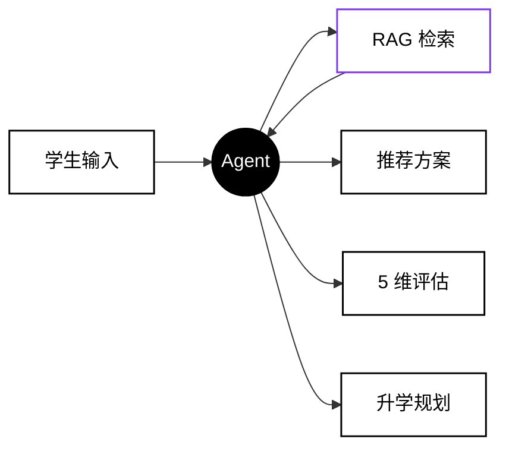

<div align="center">

<br/>

# 高考志愿 AI Agent

#### 让 AI 替你想清楚 4 年后的路

<br/>

[](https://react.dev)
[](https://www.typescriptlang.org)
[](https://vitejs.dev)
[](https://tailwindcss.com)
[](#)

<br/>
<br/>

</div>

> **不只是"我能考上哪"，而是"我应该选哪"。**
> 综合录取数据、保研政策、培养方案三类知识库，用 AI Agent 像志愿顾问一样陪你聊明白。

<br/>

<div align="center">

### `8` 页面　·　`9` 接口　·　`5` 维评估　·　`247` RAG 文档

</div>

<br/>

---

<br/>

<div align="center">

## 🎯 保研 5 维评估

<sub>从「能上哪」升级到「能保哪」——这是产品差异化的核心</sub>

<br/>

<svg width="480" height="480" viewBox="0 0 500 500" xmlns="http://www.w3.org/2000/svg">
  <defs>
    <radialGradient id="rad" cx="50%" cy="50%" r="50%">
      <stop offset="0%" stop-color="#a78bfa" stop-opacity="0.7"/>
      <stop offset="100%" stop-color="#7c3aed" stop-opacity="0.3"/>
    </radialGradient>
  </defs>
  <g stroke="#e2e8f0" stroke-width="1" fill="none">
    <polygon points="250,80 412,197 350,388 150,388 88,197"/>
    <polygon points="250,114 380,208 330,361 170,361 120,208"/>
    <polygon points="250,148 348,219 310,334 190,334 152,219"/>
    <polygon points="250,182 316,230 290,307 210,307 184,230"/>
    <polygon points="250,216 284,241 270,280 230,280 216,241"/>
  </g>
  <g stroke="#e2e8f0" stroke-width="1">
    <line x1="250" y1="250" x2="250" y2="80"/>
    <line x1="250" y1="250" x2="412" y2="197"/>
    <line x1="250" y1="250" x2="350" y2="388"/>
    <line x1="250" y1="250" x2="150" y2="388"/>
    <line x1="250" y1="250" x2="88" y2="197"/>
  </g>
  <polygon points="250,105 347,218 325,354 165,372 97,207"
           fill="url(#rad)" stroke="#7c3aed" stroke-width="2.5"/>
  <circle cx="250" cy="105" r="5" fill="#7c3aed"/>
  <circle cx="347" cy="218" r="5" fill="#7c3aed"/>
  <circle cx="325" cy="354" r="5" fill="#7c3aed"/>
  <circle cx="165" cy="372" r="5" fill="#7c3aed"/>
  <circle cx="97" cy="207" r="5" fill="#7c3aed"/>
  <text x="250" y="68" text-anchor="middle" font-size="20" font-weight="700" fill="#7c3aed">8.5</text>
  <text x="370" y="216" text-anchor="start" font-size="20" font-weight="700" fill="#7c3aed">6.0</text>
  <text x="345" y="380" text-anchor="start" font-size="20" font-weight="700" fill="#7c3aed">7.5</text>
  <text x="155" y="395" text-anchor="end" font-size="20" font-weight="700" fill="#7c3aed">8.5</text>
  <text x="80" y="205" text-anchor="end" font-size="20" font-weight="700" fill="#7c3aed">9.0</text>
  <text x="250" y="48" text-anchor="middle" font-size="14" fill="#64748b">推免机会</text>
  <text x="432" y="200" text-anchor="middle" font-size="14" fill="#64748b">竞争友好</text>
  <text x="395" y="410" text-anchor="middle" font-size="14" fill="#64748b">成绩可控</text>
  <text x="105" y="410" text-anchor="middle" font-size="14" fill="#64748b">科研加分</text>
  <text x="68" y="190" text-anchor="middle" font-size="14" fill="#64748b">去向质量</text>
  <circle cx="250" cy="250" r="40" fill="#7c3aed"/>
  <text x="250" y="248" text-anchor="middle" font-size="22" font-weight="700" fill="#fff">7.9</text>
  <text x="250" y="268" text-anchor="middle" font-size="11" fill="#fff" opacity="0.85">/ 10</text>
</svg>

<br/>

<sub>每个分数背后都有 <b>原始数据</b> 和 <b>明确文件来源</b>，不是"较高 / 较好"的模糊评价。</sub>

</div>

<br/>

---

<br/>

## 核心能力

|  |  |
|--|--|
| **🤖 AI Agent** | 5 步可视化执行链 · 流式输出 · 上下文缓存 · 快速/深度双模式 |
| **📚 RAG 知识库** | 8 类知识源 · 引用源可点击溯源 · 247 文档 / 18,642 向量切片 |
| **🎯 5 维评估** | 推免机会 · 竞争友好 · 成绩可控 · 科研加分 · 去向质量 |
| **🔐 权限体系** | 双角色（学生 / 管理员）· 路由级守卫 · 管理员专属知识库后台 |

<br/>

---

<br/>

## 工作流程



<br/>

---

<br/>

## 快速开始

```bash
git clone https://github.com/mear9713/gaokao.git
cd gaokao && npm install
npm run dev
```

打开 `http://localhost:5173` → 用 `admin / admin123` 一键登录。

<br/>

---

<br/>

## 文档

- 📋 **[接口规范](./docs/接口规范.md)** — 9 个 API · SSE 流式协议 · 完整字段
- 📊 **[数据收集要求](./docs/数据收集要求.md)** — 8 类知识源采集规范
- 🔧 **[`src/services/agentApi.ts`](./src/services/agentApi.ts)** — Agent 接口适配层（Mock + 真实切换）
- 📐 **[`src/types/index.ts`](./src/types/index.ts)** — TypeScript 类型定义

<br/>

<details>
<summary><b>展开看技术栈与项目结构</b></summary>

<br/>

**框架** · React 19 + TypeScript 6 + Vite 8 + React Router v7
**样式** · Tailwind CSS v4 + shadcn/ui (new-york) + radix-ui
**图表** · Recharts
**工具** · axios + lucide-react + clsx + tailwind-merge

```
src/
├── pages/         8 个路由页面
├── components/    auth · charts · layout · ui
├── context/       AppContext + AuthContext
├── services/      agentApi.ts ⭐
├── data/          mockData.ts
├── types/         index.ts ⭐
└── hooks/         useAppContext · useAuth
```

</details>

<br/>

---

<br/>

<div align="center">

<sub>MIT License · 2026</sub>

</div>
