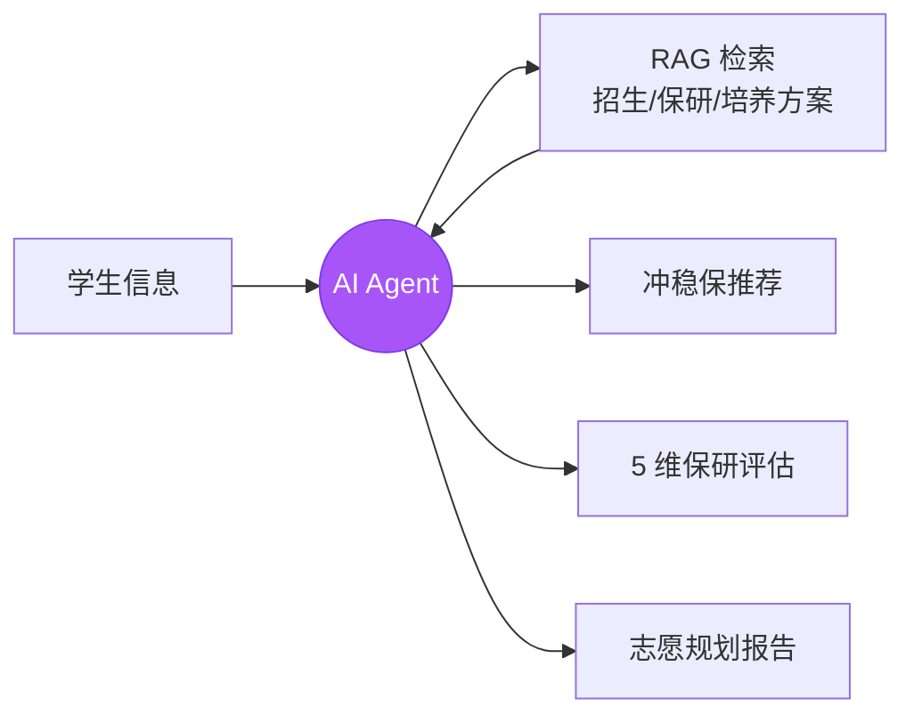
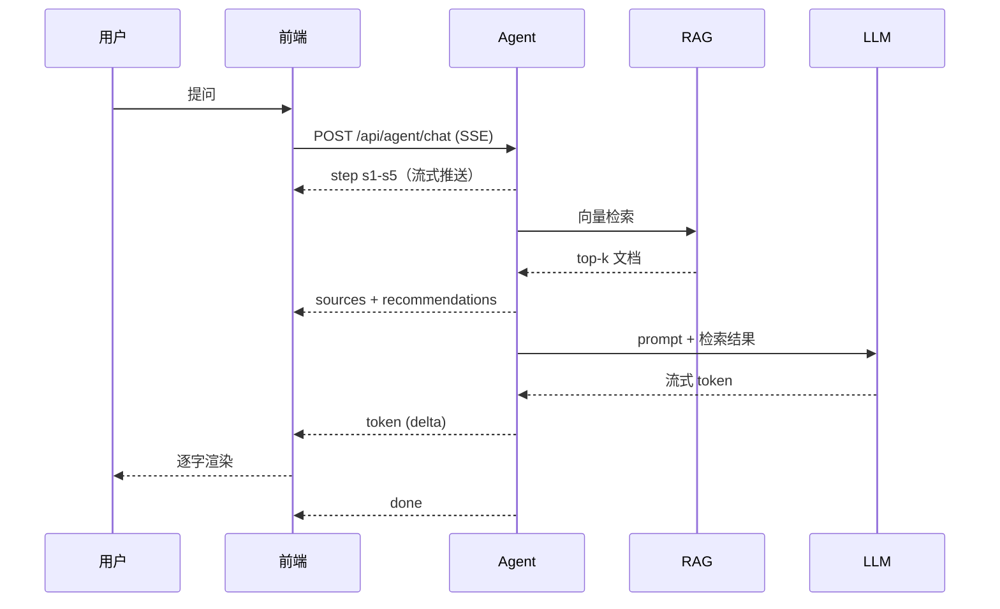

<div align="center">

# 高考志愿填报 AI Agent

为高考一本线上考生设计的志愿规划工具，综合录取数据、保研政策、培养方案，
用 Agent + RAG 给出冲稳保推荐和保研路径评估。

[](https://react.dev/)
[](https://www.typescriptlang.org/)
[](https://vitejs.dev/)
[](https://tailwindcss.com/)
[](https://ui.shadcn.com/)

[接口规范](./docs/接口规范.md) · [数据采集要求](./docs/数据收集要求.md)

</div>

---

## 它能干什么

学生填完高考信息（分数、位次、选科、偏好）之后：



跟一般志愿填报工具不同的地方在于：

- **AI Agent 显式推理**：5 步执行链全程可视化，不是黑盒
- **保研 5 维评估**：把"我能上哪"延伸到"上了之后保研竞争力如何"
- **RAG 引用可溯**：每个建议下方挂着原文摘录和文件来源

---

## 保研 5 维评估

详情页的核心模块。每所院校的目标专业都按以下 5 个维度打分（0-10）：

<div align="center">

<svg width="480" height="480" viewBox="0 0 500 500" xmlns="http://www.w3.org/2000/svg">
  <defs>
    <radialGradient id="grad" cx="50%" cy="50%" r="50%">
      <stop offset="0%" stop-color="#a78bfa" stop-opacity="0.7"/>
      <stop offset="100%" stop-color="#7c3aed" stop-opacity="0.3"/>
    </radialGradient>
  </defs>
  <g stroke="#cbd5e1" stroke-width="1" fill="none" opacity="0.5">
    <polygon points="250,80 412,197 350,388 150,388 88,197"/>
    <polygon points="250,114 380,208 330,361 170,361 120,208"/>
    <polygon points="250,148 348,219 310,334 190,334 152,219"/>
    <polygon points="250,182 316,230 290,307 210,307 184,230"/>
    <polygon points="250,216 284,241 270,280 230,280 216,241"/>
  </g>
  <g stroke="#cbd5e1" stroke-width="1" opacity="0.5">
    <line x1="250" y1="250" x2="250" y2="80"/>
    <line x1="250" y1="250" x2="412" y2="197"/>
    <line x1="250" y1="250" x2="350" y2="388"/>
    <line x1="250" y1="250" x2="150" y2="388"/>
    <line x1="250" y1="250" x2="88" y2="197"/>
  </g>
  <polygon points="250,105 347,218 325,354 165,372 97,207"
           fill="url(#grad)" stroke="#7c3aed" stroke-width="2.5"/>
  <circle cx="250" cy="105" r="5" fill="#7c3aed"/>
  <circle cx="347" cy="218" r="5" fill="#7c3aed"/>
  <circle cx="325" cy="354" r="5" fill="#7c3aed"/>
  <circle cx="165" cy="372" r="5" fill="#7c3aed"/>
  <circle cx="97" cy="207" r="5" fill="#7c3aed"/>
  <text x="250" y="68" text-anchor="middle" font-size="20" font-weight="bold" fill="#7c3aed">8.5</text>
  <text x="370" y="216" text-anchor="start" font-size="20" font-weight="bold" fill="#7c3aed">6.0</text>
  <text x="345" y="380" text-anchor="start" font-size="20" font-weight="bold" fill="#7c3aed">7.5</text>
  <text x="155" y="395" text-anchor="end" font-size="20" font-weight="bold" fill="#7c3aed">8.5</text>
  <text x="80" y="205" text-anchor="end" font-size="20" font-weight="bold" fill="#7c3aed">9.0</text>
  <text x="250" y="50" text-anchor="middle" font-size="15" font-weight="600" fill="#475569">推免机会</text>
  <text x="432" y="200" text-anchor="middle" font-size="15" font-weight="600" fill="#475569">竞争友好</text>
  <text x="395" y="410" text-anchor="middle" font-size="15" font-weight="600" fill="#475569">成绩可控</text>
  <text x="105" y="410" text-anchor="middle" font-size="15" font-weight="600" fill="#475569">科研加分</text>
  <text x="68" y="190" text-anchor="middle" font-size="15" font-weight="600" fill="#475569">去向质量</text>
  <circle cx="250" cy="250" r="38" fill="#7c3aed" opacity="0.95"/>
  <text x="250" y="248" text-anchor="middle" font-size="22" font-weight="bold" fill="#fff">7.9</text>
  <text x="250" y="268" text-anchor="middle" font-size="11" fill="#fff" opacity="0.8">/ 10</text>
</svg>

<sub>示例：西安交通大学 · 自动化（电气信息类）</sub>

</div>

每个分数都对应具体的原始数据和文件来源，不是模糊评价：

| 维度 | 分数 | 原始数据 | 来源 |
|------|:----:|---------|------|
| 推免机会 | 8.5 | 学院 28% · 专业 32% · 特色班 55% | 西安交大 2024 推免实施细则 |
| 竞争友好 | 6.0 | 保研竞争比约 3:1 | 校友会调研 |
| 成绩可控 | 7.5 | 综合测评 70% · 4.3 制 | 学籍管理办法 |
| 科研加分 | 8.5 | 国家级实验室 · 电赛国一 +3 分 | 保研加分办法 |
| 去向质量 | 9.0 | 本校直博 40% · C9 联盟 25% | 升学统计公报 |

---

## 主要功能

### AI Agent 对话

聊天页采用三栏布局（学生画像 / 对话区 / RAG 引用源），每次提问展示 5 步执行链：

1. 分析学生画像
2. 检索招生计划
3. 查询保研政策
4. 匹配院校专业
5. 生成升学建议

同场景下连续提问时，前 3 步会自动复用缓存秒过，省 token。

输出走 SSE 流式协议，回答下方挂着推荐院校卡片和"下一步建议"按钮。
还提供快速 / 深度两种模式，深度模式会多跑 2 步 + 多检索 2 个来源。

### RAG 知识库引用

8 类知识源：招生数据、录取数据、保研政策、专业信息、培养方案、奖学金政策、转专业政策、院校官网。

聊天页右侧实时展示本次回答命中的引用源，点击卡片可以展开看原文摘录和命中理由。

### 推荐结果决策看板

主流程的关键产出页。顶部展示学生画像和推荐策略摘要，下方按冲 / 稳 / 保分类铺院校卡片（默认 10 所，匹配度倒序）。
关键词（保研、985、跃迁等）会自动高亮。

### 院校详情页

按章节铺开：院校概览 → 专业详情（培养/就业/升学）→ 保研机会（5 维评估）→ 政策细则 → AI 升学建议。
顶部 sticky tab 跟随滚动高亮。

### AI 记忆

聊天页头部有个浮窗按钮，展开后展示 Agent 从历史对话里累积的：
对话中强调过的偏好、提及过的院校（按频次）、最近关注话题。
让多轮对话有连续性，不用每次重新铺设上下文。

### 管理员知识库后台

`/admin/kb` 路由，管理员专属。包含统计看板（总文档数、向量切片数、覆盖类型）、
按类型分布卡片、文档列表（搜索 + CRUD）、上传文档弹窗（自动切片入向量库）。

---

## 工作流程



---

## 技术栈

React 19 · TypeScript 6 · Vite 8 · React Router v7
Tailwind v4 · shadcn/ui (new-york) · radix-ui · recharts
axios · lucide-react · clsx · tailwind-merge

---

## 路由

| 路由 | 用途 |
|------|------|
| `/login` | 登录页 |
| `/` | 填表 |
| `/results` | 推荐结果 |
| `/detail/:id` | 院校详情 |
| `/compare` | 横向对比 |
| `/chat` | AI 咨询 |
| `/report` | 规划报告 |
| `/admin/kb` | 知识库后台（仅 admin） |

---

## 跑起来

```bash
git clone https://github.com/mear9713/gaokao.git
cd gaokao
npm install
npm run dev
```

访问 `http://localhost:5173`，演示账号 `admin / admin123`（管理员）或 `student / 123456`（学生）。

---

## 后端对接

后端只需要实现 9 个接口，前端的 service 层换掉 mock 即可：

- 接口规范：[`docs/接口规范.md`](./docs/接口规范.md)
- 数据采集：[`docs/数据收集要求.md`](./docs/数据收集要求.md)
- 类型定义：[`src/types/index.ts`](./src/types/index.ts)
- 适配层：[`src/services/agentApi.ts`](./src/services/agentApi.ts)（含 Mock 和真实 SSE 切换示例）

| 接口 | 方法 | 用途 |
|------|------|------|
| `/api/auth/login` | POST | 登录 |
| `/api/student/profile` | POST | 提交画像 |
| `/api/recommend` | POST | 推荐列表 |
| `/api/school/{id}` | GET | 院校详情（含 5 维评估） |
| `/api/agent/chat` | POST | Agent SSE 流式 |
| `/api/compare` | POST | 横向对比 |
| `/api/report/generate` | POST | 生成报告 |
| `/api/admin/kb` | GET | 知识库列表 |
| `/api/admin/kb/{id}` | POST/DELETE | 知识库 CRUD |

---

## 目录结构

```
src/
  pages/         8 个路由页面
  components/    auth · charts · layout · ui
  context/       AppContext + AuthContext
  services/      agentApi.ts
  data/          mockData.ts
  types/         index.ts
  hooks/         useAppContext · useAuth
docs/
  接口规范.md
  数据收集要求.md
```

---

License: MIT
